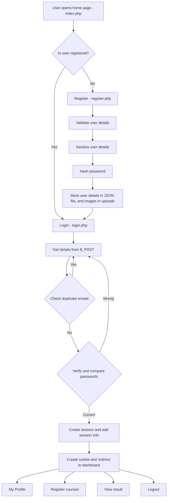

# What am I supposed to do?

Create a platform to enable students login, view profile, register courses and view results.

## Flow

#### For registration

Validate:

* Name is required and at least 3 characters.
* Email must be valid.
* Password must be at least 8 characters and contain uppercase, lowercase, number and special character.
* Age must be between 16–40.
* Department is required.
* Level must be 100, 200, 300, 400 or 500.
* Profile picture must be an image, JPG/JPEG/PNG and maximum 2MB.

#### STORAGE
Store registered students in:

text
data/students.json

Use:

text
json_encode()
json_decode()

Each student should contain:

text
name
email
password
age
department
level
profile_picture

Before registration, check that the email does not already exist.

#### 4. FUNCTIONS

Create functions/helpers.php.

Create reusable functions for tasks such as:

text
sanitizeInput()
validateEmail()
validatePassword()
validateAge()
saveStudent()
getStudents()

#### 5. STUDENT CLASS

Create classes/Student.php.

Create a Student class with:

text
name
email
age
department
level
profilePicture

Include:

* Constructor
* Methods
* $this
* Appropriate getter/details methods

Create Student objects using the class.

---

#### 6. LOGIN – login.php

Create a login form for:

text
Email
Password

Use $_POST and $_SERVER["REQUEST_METHOD"].

Read students from students.json.

Find the student's email and verify the password using:

php
password_verify()

If successful:

text
$_SESSION["logged_in"] = true
$_SESSION["student_email"] = $email

Redirect to dashboard.php.

If unsuccessful, display an appropriate error message.

---

####  7. COOKIE

After successful login, create a cookie containing the student's email.

The cookie should last *1 day*.

If the cookie exists on the login page, display the student's last login email.

---

8. DASHBOARD – dashboard.php

Only logged-in students should access this page.

Display:

* Name
* Email
* Age
* Department
* Level
* Profile Picture

Provide links to:

text
My Profile
Register Courses
View Result
Logout

Use $_SESSION to identify the logged-in student.

---

 9. PROFILE – profile.php

Display the student's:

* Full Name
* Email
* Age
* Department
* Level
* Profile Picture

---

10. COURSE REGISTRATION – courses.php

Provide these courses:

text
Mathematics
English
Chemistry
Physics
Biology
Computer Science

Use checkboxes with:

text
courses[]

Student must select:

* Minimum: 2 courses
* Maximum: 5 courses

Store the selected courses in the session.

---

 11. COURSE SEARCH – courses.php

Allow students to search for courses using $_GET.

Example:

text
courses.php?search=chemistry

Use:

text
$_GET
array_filter()
callback function

to display courses matching the search.

---

 12. RESULT – result.php

Allow the student to enter scores for their registered courses.

Create:

php
calculateGrade($score)

Use:

text
70–100 = A
60–69  = B
50–59  = C
45–49  = D
40–44  = E
0–39   = F

Also create a remark:

text
A = Excellent
B = Very Good
C = Good
D = Pass
E = Pass
F = Fail

Calculate and display the student's average score.

---

 13. RESULT CLASS

Create classes/Result.php.

Create a Result class with methods such as:

text
calculateGrade()
calculateRemark()
calculateAverage()

Use:

* Class
* Object
* Properties
* Methods
* Constructor where appropriate
* $this
* return

---

14. JSON API – students.php

Create students.php that returns all registered students as JSON.

Use:

php
header("Content-Type: application/json");

The page should return JSON only, not HTML.

---

15. LOGOUT – logout.php

Destroy the student's session and redirect to login.php.

---

 REQUIRED CONCEPTS

Your project must demonstrate all of these:

text
✓ Functions
✓ Parameters & Arguments
✓ Return
✓ Arrays
✓ foreach
✓ if/else
✓ Regular Expressions
✓ $_GET
✓ $_POST
✓ $_SERVER
✓ $_SESSION
✓ $_COOKIE
✓ $_FILES
✓ Validation
✓ Sanitization
✓ password_hash()
✓ password_verify()
✓ File Upload
✓ JSON
✓ json_encode()
✓ json_decode()
✓ array_filter()
✓ Callback Functions
✓ Classes
✓ Objects
✓ Properties
✓ Methods
✓ Constructor
✓ $this

---

RULES

1. No database.
2. No JavaScript validation.
3. No frameworks.
4. Do not store plain-text passwords.
5. Do not trust user input.
6. Use htmlspecialchars() when displaying user input in HTML.
7. Avoid repeated code; use functions where appropriate.
8. Your application should not produce PHP warnings or undefined-index errors during normal use.

---

 BONUS

1. Delete Account

Allow a logged-in student to delete their account and profile picture.

 2. Edit Profile

Allow a student to edit:

text
Name
Age
Department
Level

and update students.json.

3. Admin Page

Create admin.php showing all registered students with:

text
Name
Email
Department
Level

---